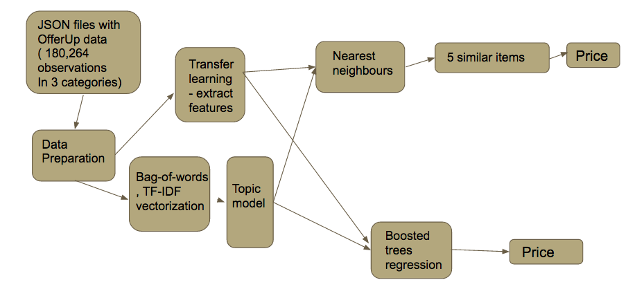
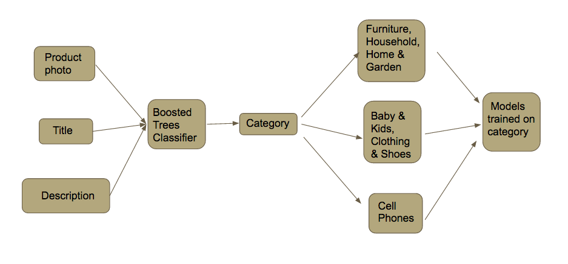
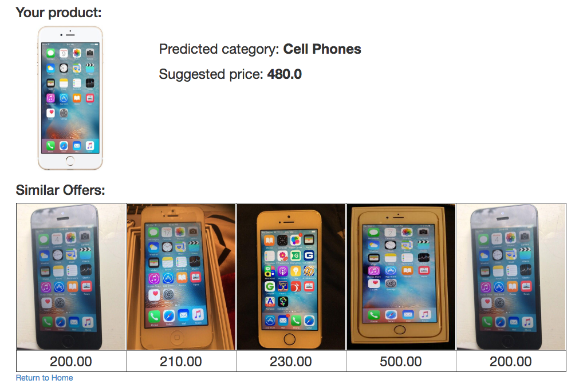
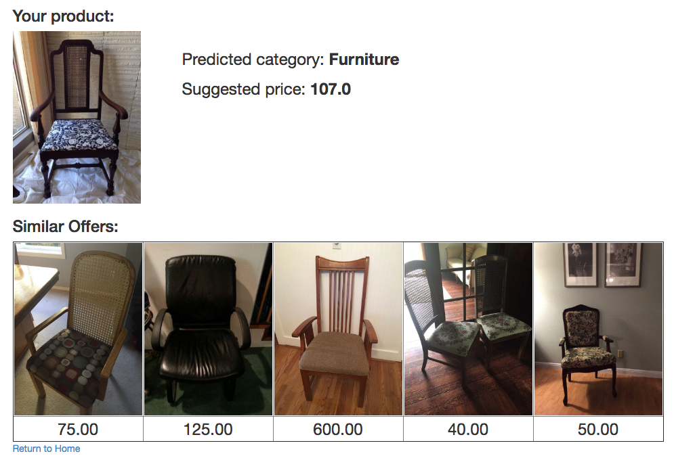
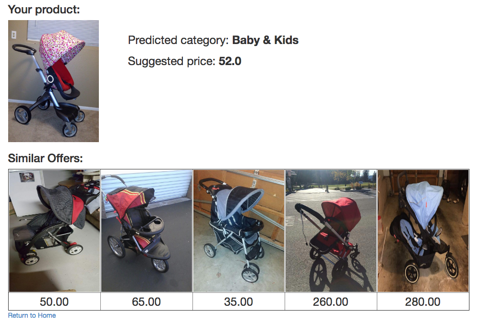
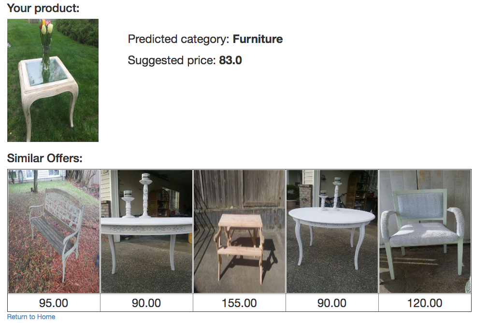

# Price recommender
Galvanize Data Science Program. Capstone Project.


## Overview
Price recommendation by product picture. Project aims to save your time and money predicting fair market price for product by analyzing title, description and finding similar items by picture. As OfferUp says, "with a single snap, you can take a photo of an item and instantly circulate it to people nearby". It's not exactly true as one still has to set price which could be hard without research. This project fills the gap and allows for true one-click listing.

Analysis was conducted on an Amazon Web Services EC2 instance using NLP and Neural Network.


## Data source
All data were scraped from OfferUp (offerupnow.com). OfferUp is mobile marketplace that provides safe and convenient place to easily buy and sell used goods.

**script/scrap_offerup.rb** issues HTTP requests to https://offerupnow.com/ and scraps recent offers page by page until the date limit was reached. Each offer is stored into file in JSON format.

**script/normalize_scraped.rb** splits and combines offers into 3 JSON files, namely:

* items.json 605 Mb 380,107 items
* owners.json 141.2 Mb item owners
* images.json 214.1 Mb links to item images

**script/download_images.rb** downloads images and sorts them between subfolders by size:
* detail
* full
* list

## Data Preparation

items.json contains 300,304 unique items with 34 fields per item. Items belong to 37 different categories.

To simplify the model, we picked most interesting categories and joined them into 2 supercategories:

```
Baby & Kids              37114
Clothing & Shoes         27743
Games & Toys              8149  


Furniture                22857
Household                21974
Home & Garden            9529

Cell Phones              14307 - select phones
Electronics              14967 - select phones
```

Models were trained and fine-tuned for each supercategory separately.

### Selected features
features = ['id', 'description', 'title', 'category_name', 'price']


#### Image processing:
For images I'm using GraphLab Create API extract_features method which is a pre-trained model for ImageNet, as described by Alex Krizhevsky et. al. (https://static.turi.com/products/graphlab-create/resources/models/python2.7/imagenet_model_iter45 ).  It requires 256 x 256 x 3 images. and takes an input, propagates each example through the network, and returns an SArray of feature vectors. These feature vectors I use as input to train BoostedTreesRegression and BoostedTreesClassifier models.

### References:
Krizhevsky, Alex, Ilya Sutskever, and Geoffrey E. Hinton. “Imagenet classification with deep convolutional neural networks.” Advances in neural information processing systems. 2012.

#### Text processing:

I build topic model based on TF-IDF vectorization of product title and description and use topics as features in training BoostedTreesRegression and BoostedTreesClassifier models.

### Nearest Neighbors

On the last step I use BoostedTreesRegression model to predict the exact price and Nearest Neighbors model to get top 5 nearest offers to display for user and choose median price value as recommendation.

### Model - How it works from data side



### Model - How it works from user side




### Results

Result shows that it works good for clear cases as:

### Phones


### Single furniture


### But it can not separate expensive strollers from simple ones


### Or sometime confuses about guessing right product


## Future Work
* Add weight to text features and use more advanced featurization techniques with text (e.g. Doc2Vec) to maximaze information extraction from the data.
* Predict price interval instead of exact price.
* Build own Neural Network which will use mobile format size of image instead of 256 x 256.


## Packages used
* NumPy
* pandas
* scikit-learn
* matplotlib
* GraphLab Create
* Flask
